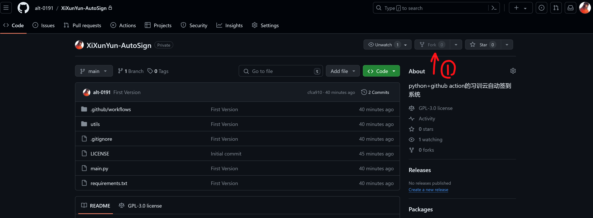
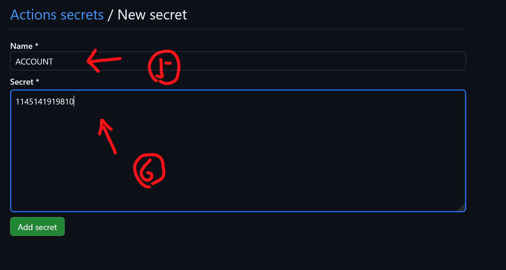
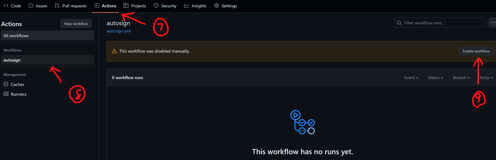
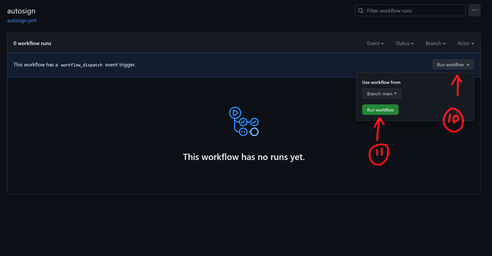
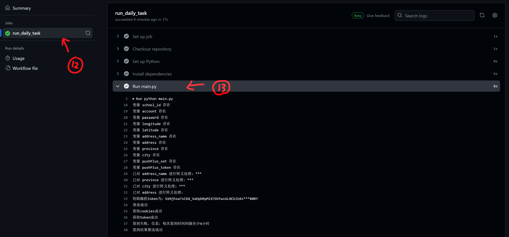
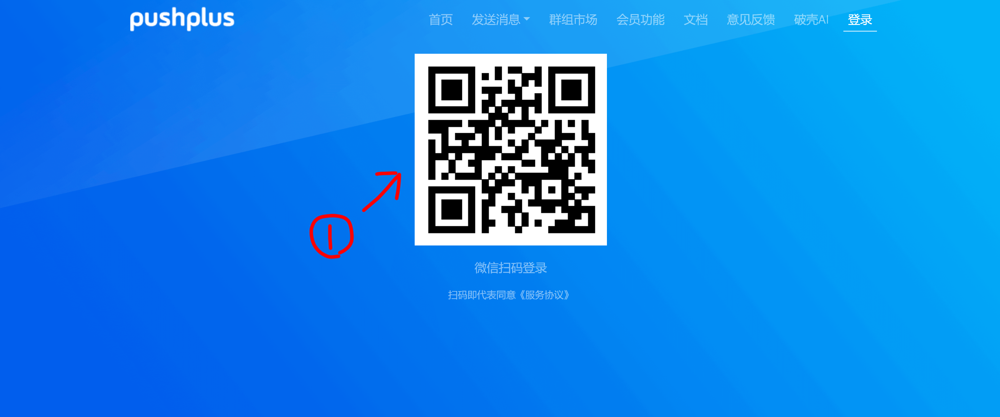
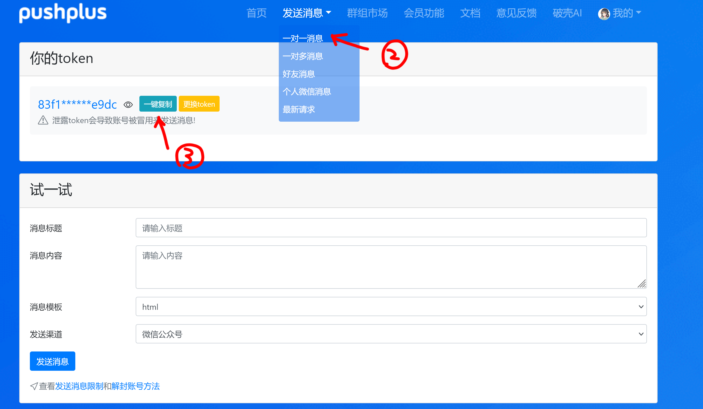
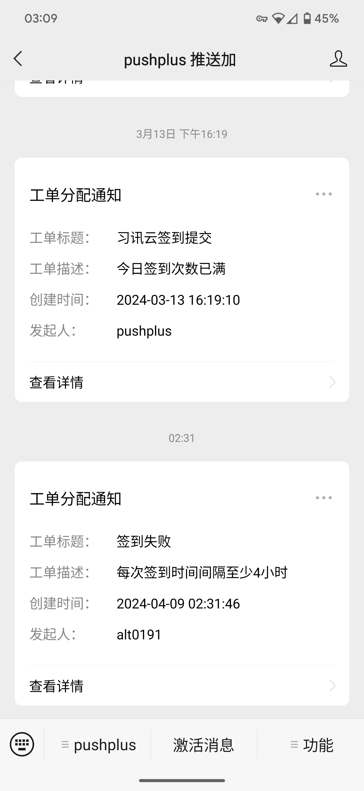

# XiXunYun-AutoSign

### 本项目是 [xixunyun-auto](https://github.com/EaxMov/xixunyun-auto) 的Python实现，支持自动进行习讯云实习签到。默认签到时间为每天早上8点，你可以通过修改 `.github/workflows/autosign.yml` 中的 cron 表达式来自定义签到时间。

**注：** 本readme内容参考了原项目，希望作者不要介意。

---
## 配置指南

### 必要配置项

为了使用此自动签到功能，你需要配置以下必要信息：

- **ACCOUNT** - 登录账号
- **PASSWORD** - 登录密码
- **LONGITUDE** - 实习地址经度
- **LATITUDE** - 实习地址纬度
- **SCHOOL_ID** - 学校ID(请在学校列表.json中搜索)
- **ADDRESS** - 详细地址（例如：xx省xx市xx街道）
- **ADDRESS_NAME** - 地址名称（例如：xxx公司）
- **PROVINCE** - 省份（例如：xx省）
- **CITY** - 城市（例如：xx市）

### 可选配置项（用于微信推送）

- **PUSHPLUS_SET** - 是否启用推送（`0`为不推送，`1`为仅推送失败信息，`2`为无论成功失败都推送）
- **PUSHPLUS_TOKEN** - Push Plus的推送Token

## 配置步骤
### 1. **Fork本项目**到你的GitHub仓库。

### 2. 在你的GitHub仓库中，依次点击`Settings` > `Secrets and variables` > `Actions`，然后点击`New repository secrets`。

### 3. 在`Name`字段填入上述必要配置信息的键，`Secrets`字段填入对应的实际值。

### 4. 点击`Actions` > `autosign`，然后点击`Enable workflow`以启动自动工作流。

### 5. 点击两个`Run workflow`手动运行一次。

### 6. 运行完成后，打开`autosign`工作流，点击`run_daily_task`，然后`Run main.py`查看运行结果。如果你已经签到过，可能会看到签到失败的提示；正常情况下，应显示签到成功。

## 微信推送配置（可选）

如果不需要微信推送功能，可以跳过此步骤。

### 1. 访问 [pushplus](https://www.pushplus.plus)，使用微信扫码登录。

### 2. 点击`发送消息` > `一对一消息`，生成你的token，复制并填入`PUSHPLUS_TOKEN`字段，并根据需要选择推送类型。

### 3. 查看推送结果。

    

## 参考与致谢

### - [xixunyun-auto](https://github.com/EaxMov/xixunyun-auto)
### - [xixunyun-b](https://github.com/lanzeweie/xixunyun-b)

### 特别感谢小久在我coding时陪我狗叫

---

## 如果你觉得本项目对你有帮助，不妨给它一个⭐Star吧！